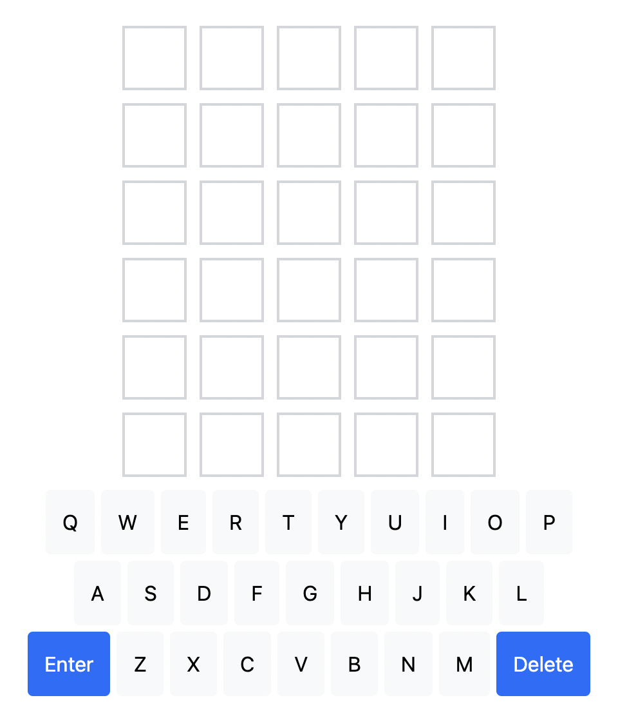
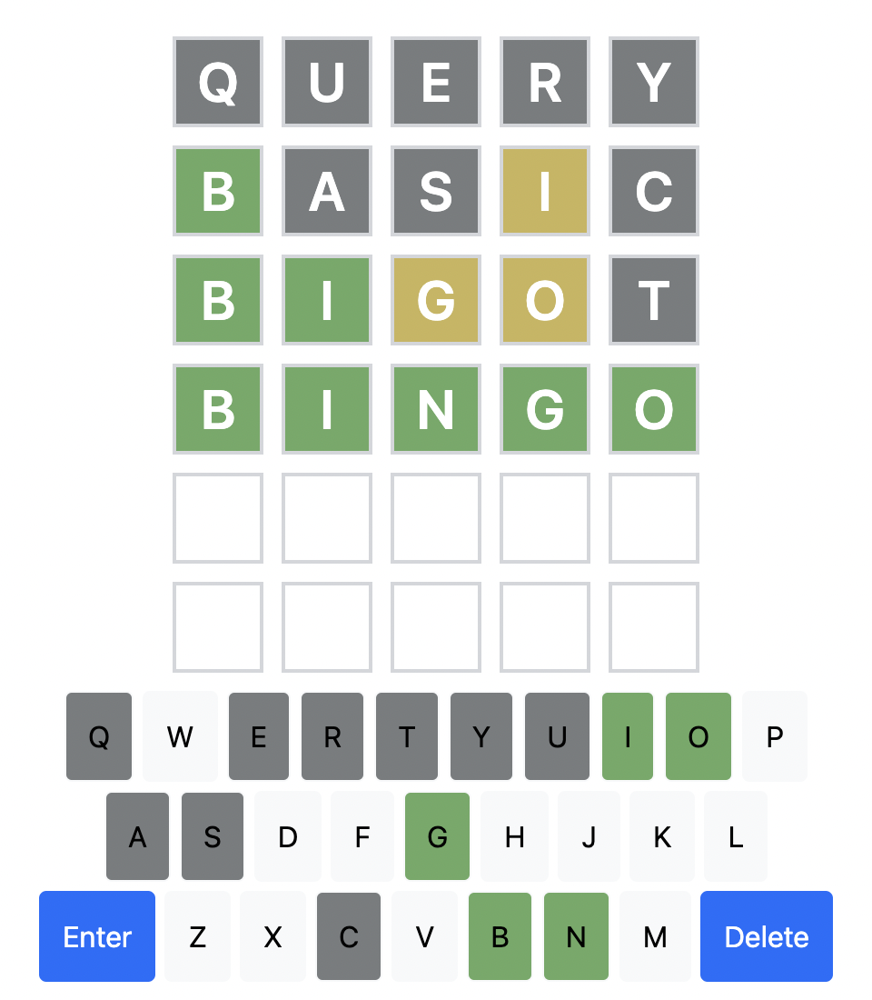

# HelloWord

基于 Edge 拓展的 Wordle 游戏

- 游戏目标：在六次尝试机会之内，猜出一个五字母单词
- 游戏玩法：界面上方是一个 6\*5 的方块阵列，玩家通过下方键盘输入猜测结果后，游戏会给玩家猜测结果标上颜色
  - 绿色 🟩：答案里有这个字母，且位置正确
  - 黄色 🟨：答案里有这个字母，但位置不正确
  - 灰色 ⬜：答案里没有这个字母

#### 成功样例

#### 失败样例

